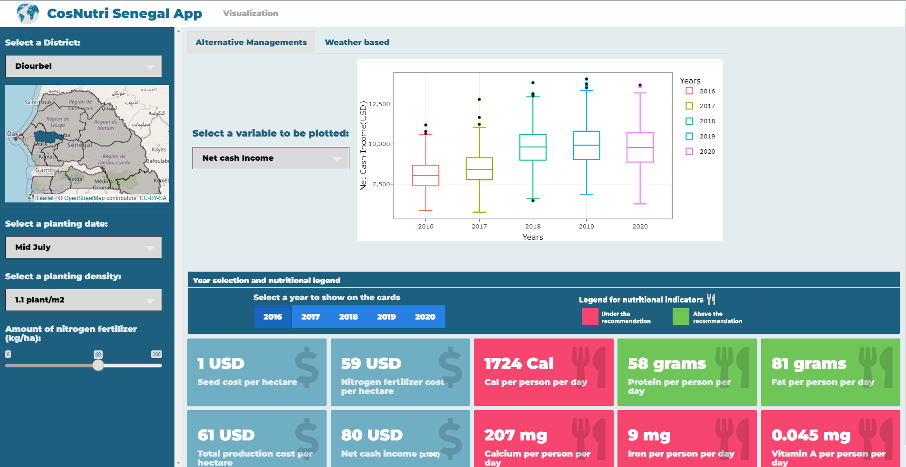
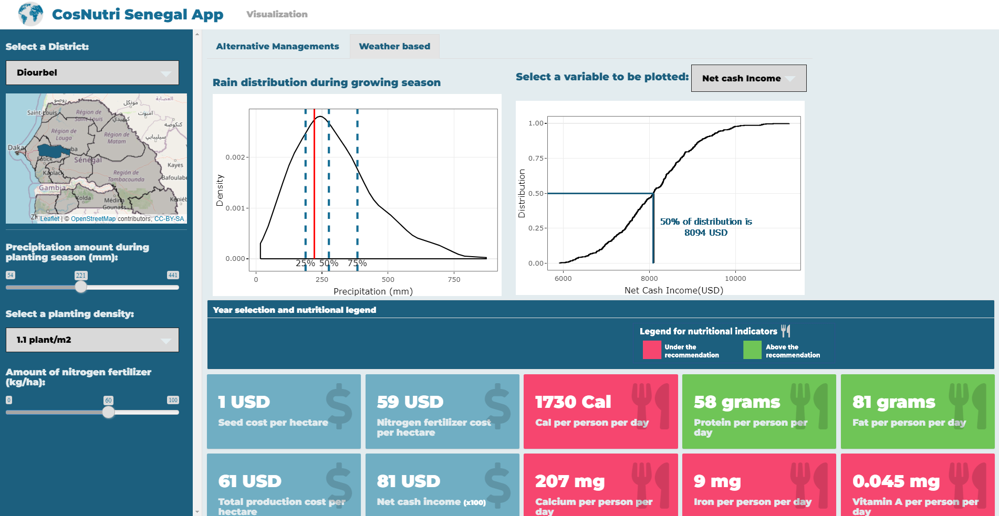

# CosNutri - <small>A dashboard for costs and nutrition information from simulations of pearl millet at Senegal</small>

## Table of Contents
1. [Objective](#objective)
2. [Simulations Overview](#simulations-overview)
3. [Data and data manipulation](#data-embed)
4. [Description](#description)
5. [Structure](#structure)
6. [Libraries](#libraries)
7. [CSS](#css)
8. [How it works](#how-it-works)
9. [About](#about)
10. [Future Works](#future-works)
11. [Acknowledgements](#acknowledgements)

---

## Objective
The objective of this dashboard was to generate an interactive platform to display the results obtained from simulations of costs and nutritional information of pearl-millet cultivation at Senegal.

---

## Simulations Overview

**(About section)**

---

## Data and data manipulation
The data used in this dashboard are mainly the iterations (both 500 and main values) and rain data of Senegal collected since 1990. Excepting the iterations, the data were inserted in the dashboard as csv files. The iterations were inserted in xlsx format and as resource files.

The raw data were manipulated using R programming language. The commented program build to do it is available on this repository with the name of "data_manipulation.R". 

The program does:
1. Extract planting dates for each district;
2. Processing the production table;
3. Precipitation data retrieving: getting precipitation for 2016-2021 during growing season;
4. Precipitation of growing season since 1990;

The replacement of departments for district was made manually.

---

## Description

The framework chosen to build the app was Shiny using R computational language due to the facilitation to create and use an interactive and free-to-use dashboard.

The main idea to display the data was a sidebar and a main screen as shown below:

In the sidebar, users can:
1. Select the district, with a reactive map of Senegal, so they are able to see on it where the selected district is;
2. Planting density;
3. Amount of nitrogen fertilizer and;
4. Planting date or precipitation during pearl millet growing season;

On the main screen, there is a tab selection and value cards. The tab selection allows the users to choose between "Alternative managements" and "Weather based". Selecting these options, the item number 4 in the sidebar list above, the graphs and the years' selection change.

Screenshot of Alternative management tab selection

Selecting the Alternative management tab, users can:
- Select a planting date as input (each district has different planting dates);
- Visualize a box plot rendering 500 iterations of 2016, 17, 18, 19 and 2021 for the variable selected in the selectize located in the left and;
- Based on the box plot, the user can select a year and the value cards will display the mean values of that year for all variables. The value cards for nutrition also change their colors if the value is above or under the recommendation.

Screenshot of Weather based tab selection

Selecting the Weather based tab, users can:
- Select a precipitation amount during the pearl millet growing season. Those values can change depending on the district selected. The slide values were obtained by manipulating rain data of districts during the growing season of 2016-2021;
- Visualize a density and a distribution plot. The density plot displays the rain data during the growing seasons for selected district over 32 years. The distribution plot displays the values' distribution of the selected variable over the 500 iterations;
- Since for each precipitation value selected, there is a year embedded, there was no need of a radio check for year selection for value cards.

---

## Structure

The app were using the **flexdashboard** library and Rmd file format to facilitate the assembly of the app "skeleton". The CSS and the R file for the functions were made in a separated file and embedded in the app. The R file with the functions were used to filter information for used in the value cards and generate the charts. There are 3 "son" folders containing files used in the app:
- data: containing all the csv and xlsx files used;
- www: all the images and;
- shapefiles: shapefiles for Senegal district's.

---

## Libraries
13 libraries were used in the app:

| Purpose | Libraries | 
| ----------- | ----------- |
| Shiny framework usage | shiny; flexdashboard; shinydashboard; shinythemes; shinyWidgets |
| Map usage | leaflet; sf|
| Data manipulation | tidyverse |
| Graph usage | ggplot2; plotly; scales |
| Data import | openxlsx|
| Include HTML content | htmltools |
---

## CSS
In the CSS file, there are modifications for the app to:
- Styles for the bootstrap widgets for Shiny;
- Adaptations for usage in small screens;
- Font and colors;
- Shiny error messages hiding;
- Adaptations to make leaflet map doesn't display zoom buttons;
- Position of image working as a legend;
- Position of elements in the tabset;

---

## How it works
By user selections in the sidebar widgets, tab selectizes and radio buttons for years, the data of interest is filtered. The filtering process uses functions present in the functions.R file embedded in the app as a source.

For the value cards, the csv containing only the mean values for the iterations is just filtered.

For all the graphs, in addition to the filtering process, there is also the graph (ggplot2) generation.

---

## About
The about section were written in HTML in a different file (about.html) and inserted into the app using the htmltools library.

---

## Future Works
Merge this app with the previous Senegal SIAF app.

---

## Acknowledgements
The app was made by Gustavo N. Santiago, with feedbacks from Ana J. P. Carcedo (both from Ciampitti Lab at Kansas State University), Kieron and Pouyan from Michigan State University and the Consortium members during an in-person meeting at Winter Park-CO on March 2023.

This study was supported by the Feed the Future Innovation Lab for Collaborative Research on Sustainable Intensification (SIIL) at Kansas State University through funding United States Agency for International Development (USAID) under the Cooperative Agreement (Grant number AIDOAA-L-14–00006).